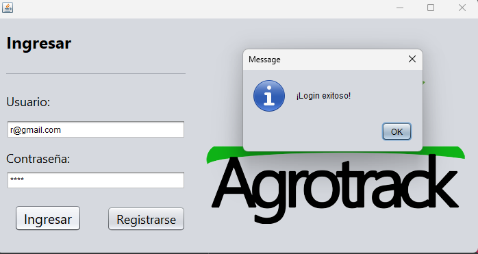
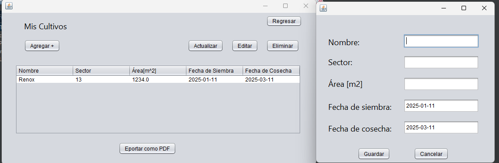
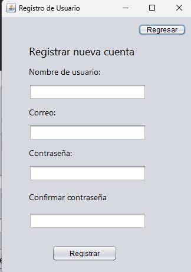
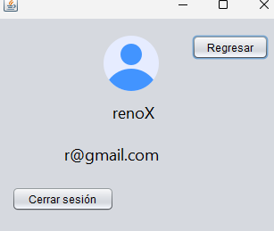
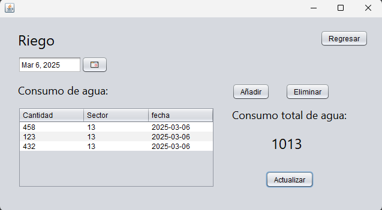

# Java-Based Crop Management
* A Java application for crop control using JFrames and Django.
* I use DAOs to manage the mongo Data base
* I use the MVC Model–view–controller
* I can manage the users who are logged in
* I can export a PDF file with the crop data for the logged-in user
* I implemented a CRUD for the crops. (Create, Read, Update, and Delete)
* I used JFrames for the UI.

  

<b>Login Screen</b>

  

<b>Crop Control</b>

  

<b>Register Screen</b>

  

<b>Logged-in screen</b>

  

<b>Water Usage Screen</b>

